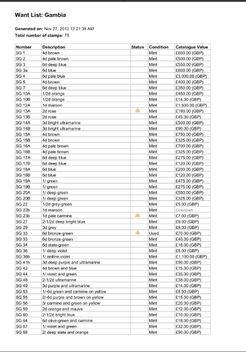

# Stamp Web Reports Design

## Key Requirements

* Generate a PDF Report
* Stamps included should be based on the current filtered list
* Stamps may be further filtered based on options in report generation
* Reports will generally be tabular based
* Reports will be based on a pre-defined set of report options.  While it might be nice to build custom reports at this time the reports will be fixed.

## User Experience

* User searches/views a set or collection of stamps
* User clicks the report generate action
* User is presented with a dialog and asked to choose
  * Type of Report - presented as a visual representation of the report
  * Specific options (include image, excluded wantlist items etc)
  * Name of report
* User clicks Generate and the dialog closes and their report is opened as a PDF page for printing

## Technical Concerns

* pdfmake will be used to generate the reports.  This takes in a configuration definition in a JSObject.  The report dialog/view model
will be responsible for building this model and feeding it to the generator.
* The dialog will be passed a list of the stamps to include in the dialog.  Another option would be to only send the search criteria
from the view and allow the client to make a call to the server without a size limit to prevent pagination of results

## Want List Report
* Show "Wantlist: {Title}"
* Show generation time
* Show table with the following columns
  * Number (primary/active)
  * Rate + Description
  * Status (if the item is damaged)
  * Condition
  * Catalogue Value
  
*Comments*
* Condition can probably be the following and save horizontal space 
  * (*) - no gum
  * *- gum hinged
  * ** - Never hinged
  * ʘ - used
  * ◙ - used on cover
* Should look at adding secondary catalogue number
* Notes?   

